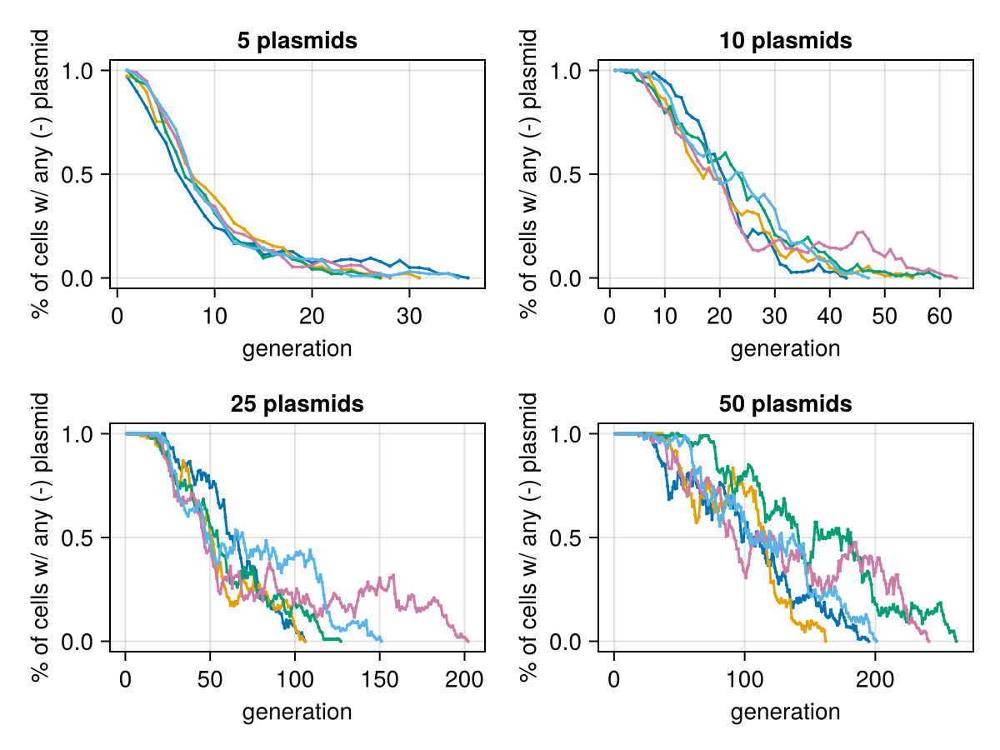

# Plasmid selection simulation

Simulation of selection of plasmid mutant selection
in the face of multi-copy plasmids.

## Assumptions

1. Some "ideal" copy number N (configurable).
   If n < N, all plasmids are duplicated.
   If n > N, all plasmids have an N/n chance of being retained
2. Some "ideal" population size P (configurable).
   If p < P at the end of a generation, no action is taken.
   If P > p at the end of a generation, each cell has a P/p chance of surviving.
3. Cells survive if they have even 1 copy of the selection gene.
   Possible enhancement would be to have chance of survival proportional to the copy number
   (up to some maximum), but this is not implemented

## Simulation

1. All cells exactly duplicate their plasmids (only keeping track of + or -).
2. Plasmids are randomly assigned to daughter cells.
3. Plasmid numbers are normalized according to assumption 1
4. Any cells lacking at least 1 positive plasmid are removed (see assumption 3)
5. If population size is too large, cells are randomly culled (see assumption 2)

